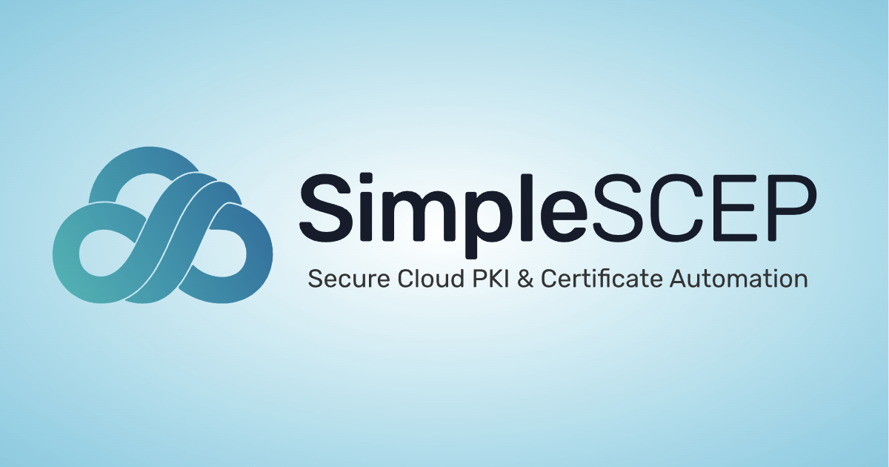

<p align="center">
  
</p>

<h1 align="center">SimpleSCEP</h1>

<p align="center">
  A self-hosted private certificate authority for SCEP, ACME, and EST.
</p>

<p align="center">
  <a href="https://docs.simplescep.com">Documentation</a> ·
  <a href="#quick-start">Quick start</a> ·
  <a href="CONTRIBUTING.md">Contributing</a> ·
  <a href="SECURITY.md">Security</a>
</p>

## Quick start

With Docker and Docker Compose installed:

```sh
git clone https://github.com/jacksongrow0/SimpleSCEP.git
cd SimpleSCEP
docker compose up --build
```

Open the one-time `/setup?token=...` URL printed in the application logs, then create the administrator at `http://localhost:8080`.

> [!WARNING]
> This quick start is disposable: PostgreSQL data and in-memory CA keys are discarded when the Compose stack is removed. Use the production configuration below for persistent deployments.

SimpleSCEP provides a browser-based administration console, certificate issuance and revocation, CRL and OCSP publication, audit logging, mandatory MFA, expiry notifications, and an optional Microsoft Intune connector.

## Architecture and security model

- PostgreSQL stores application state and enforces organization isolation with forced row-level security. The application refuses a superuser or `BYPASSRLS` connection.
- Production CA keys and secret-wrapping keys use Google Cloud KMS or Azure Key Vault; each CA independently selects software or HSM protection.
- Browser authentication uses email magic links plus mandatory TOTP or WebAuthn.
- One deployment contains one organization. The first administrator is created through a one-time setup URL printed at startup.
- Resend delivers production authentication, invitation, and expiry-notification email.

See the detailed [SCEP](docs/scep.md), [ACME](docs/acme.md), [EST](docs/est.md), [Intune](docs/intune-app-registration.md), and [two-factor authentication](docs/two-factor.md) guides. The hosted documentation is available at [docs.simplescep.com](https://docs.simplescep.com).

## Supported components

- Go 1.25.5
- Node.js 22.23.2 and npm
- PostgreSQL 17
- Google Cloud KMS or Azure Key Vault for production key storage
- Resend for production mail delivery
- Docker with Compose for the disposable local demonstration

## Development

For host development, copy `.env.example` to `.env`, configure PostgreSQL, run `npm ci`, then run `go run ./cmd`. Generated templates and browser assets are intentionally not committed. To reset the disposable Compose environment, run `docker compose down` followed by `docker compose up --build`.

## Production configuration

Start from `.env.example`. At minimum, production requires:

- An HTTPS `APP_URL` and explicit `TRUSTED_PROXY_CIDRS`.
- A dedicated PostgreSQL role that is neither a superuser nor granted `BYPASSRLS`, with authenticated TLS to the database. Follow the [PostgreSQL role and database setup](docs/postgresql.md); do not use `postgres` or another administrative login.
- A random `AUTH_SECRET` of at least 32 characters.
- `RESEND_API_KEY` and `MAIL_FROM`; the sender must be verified in the operator's Resend account. `MAIL_REPLY_TO` is optional for invitations and alerts.
- `KEY_PROVIDER=google` with `GOOGLE_CLOUD_KMS_KEY_RING` and `GOOGLE_CLOUD_KMS_PROTECTION_KEY`, or `KEY_PROVIDER=azure` with `AZURE_KEY_VAULT_URL` and a versioned `AZURE_KEY_VAULT_PROTECTION_KEY`.
- Provider credentials authorized to create, inspect, use, attest, and delete software- and HSM-backed keys. Protection is selected independently when each CA is created. Both providers use their default credential chains; managed identity is recommended on Azure.

`KEY_PROVIDER=local` is deprecated and refused for non-development hostnames. Its keys exist only in memory and losing them destroys access to CA signing keys, TOTP secrets, SCEP RA keys, and ACME EAB material.

The Intune connector is optional and disabled when its client ID and secret are unset. Review `.env.example` for proxy, database TLS, and KMS details before deploying.

See [Azure Key Vault](docs/azure-key-vault.md) for vault requirements, protection-key provisioning, RBAC, authentication, and the current CA-import limitation.

## Builds, upgrades, and releases

Pull requests generate templates/assets, run the Go suite, apply the schema to an empty PostgreSQL database, and build the container. Version tags publish multi-platform images to GitHub Container Registry with provenance and an SBOM attestation.

The initial open-source schema supports fresh installations only; databases from the earlier unreleased hosted-service code are not upgrade-compatible. After the first public release, migrations are append-only and releases follow semantic versioning. See [RELEASING.md](RELEASING.md) and [CHANGELOG.md](CHANGELOG.md).

## Community and security

Use [GitHub Issues](https://github.com/jacksongrow0/SimpleSCEP/issues) for reproducible bugs and feature requests. Do not post suspected vulnerabilities or real certificate material publicly; follow [SECURITY.md](SECURITY.md).

Contributions are welcome under [CONTRIBUTING.md](CONTRIBUTING.md) and the [Code of Conduct](CODE_OF_CONDUCT.md). SimpleSCEP is licensed under [Apache License 2.0](LICENSE). The license does not grant trademark rights beyond customary identification of the project.
